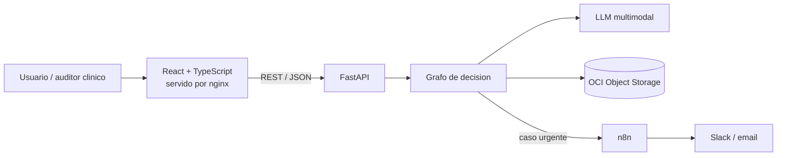
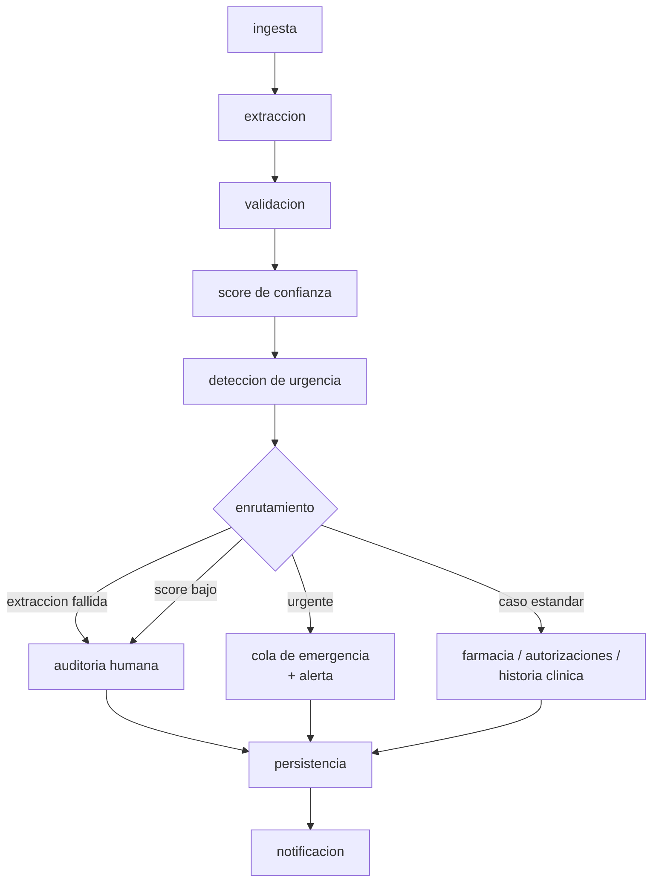

# 🏥 MediFlow-G10-LATAM-Equipo-08


**Agente autónomo para triaje, extracción y enrutamiento de documentos clínicos.**
Programa ONE · Grupo 10 — Hackathon Oracle Next Education & Alura.

> ⚠️ **Esto no es un dispositivo médico.** Es un proyecto académico de triaje documental, no una herramienta de diagnóstico clínico.

## Índice

- [🏥 MediFlow-G10-LATAM-Equipo-08](#-mediflow-g10-latam-equipo-08)
  - [Índice](#índice)
  - [Objetivo del proyecto](#objetivo-del-proyecto)
  - [Qué hace MediFlow](#qué-hace-mediflow)
  - [Arquitectura del sistema](#arquitectura-del-sistema)
  - [Grafo de decisión](#grafo-de-decisión)
  - [Stack tecnológico](#stack-tecnológico)
  - [Cómo iniciar el proyecto](#cómo-iniciar-el-proyecto)
    - [Versionado — regla del equipo](#versionado--regla-del-equipo)
    - [Levantar el entorno (una vez exista `docker-compose.yml`)](#levantar-el-entorno-una-vez-exista-docker-composeyml)
  - [Estructura del repositorio](#estructura-del-repositorio)
  - [Equipo](#equipo)
  - [Documentación del proyecto](#documentación-del-proyecto)

---

## Objetivo del proyecto

Hospitales, laboratorios y aseguradoras pierden horas leyendo manualmente informes y recetas para transcribir datos en sistemas heredados. MediFlow recibe un documento clínico (texto, PDF o imagen), lo clasifica, extrae sus datos esenciales con un LLM multimodal, calcula un puntaje de confianza, detecta urgencias médicas y lo enruta al destino correcto — dejando los casos ambiguos o de baja confianza en una cola de revisión humana (Human-in-the-Loop).

**Principio central: el LLM propone, el sistema decide.** El modelo extrae datos y sugiere tipo de documento y prioridad; el score de confianza y el destino final los calcula código auditable con reglas explícitas, no una frase suelta del modelo.

## Qué hace MediFlow

1. **Ingiere** el documento clínico en PDF, imagen o texto.
2. **Clasifica** su categoría (receta, informe de estudio, orden de procedimiento, epicrisis, certificado médico).
3. **Extrae** datos clínicos y administrativos estructurados (paciente, profesional, diagnóstico/CIE-10, medicamentos, dosis, urgencia).
4. **Valida** consistencia y calcula un puntaje de confianza sobre la extracción.
5. **Enruta** automáticamente al destino correspondiente (emergencia médica, auditoría de autorizaciones, farmacia, historia clínica) o a revisión humana si hay ambigüedad.
6. **Persiste** el documento y la decisión en OCI Object Storage, organizados por estado.

## Arquitectura del sistema



| Capa | Elección |
|---|---|
| Frontend | React + TypeScript (Vite) |
| API | FastAPI + Pydantic v2 |
| Orquestación IA | LangGraph — grafo de decisión explícito y auditable |
| Base de datos | PostgreSQL, contenedor en OCI Compute |
| Almacenamiento | OCI Object Storage — un bucket, prefijo por estado del documento |
| Alertas | n8n, solo notificaciones (Slack/email) sobre casos urgentes |
| Despliegue | Docker Compose sobre OCI Compute (capa Always Free) |

## Grafo de decisión



Cada dato que extrae el modelo lleva su cita textual de origen, y el sistema verifica que esa cita exista en el documento antes de confiar en el dato. Un caso es urgente si lo dice el modelo **o** si aparece un signo de alarma de una lista determinista — en salud, revisar un caso de más es preferible a dejar pasar una urgencia.

## Stack tecnológico

- **IA:** Google Gemini (modelo multimodal), LangGraph para el grafo de decisión.
- **Backend:** Python 3.12, FastAPI, Pydantic v2, arquitectura hexagonal (dominio / aplicación / adaptadores).
- **Frontend:** React 19 + TypeScript + Vite + Tailwind + shadcn/ui.
- **Datos:** PostgreSQL 16.
- **Cloud:** Oracle Cloud Infrastructure — Object Storage y Compute (capa Always Free).
- **Automatización de alertas:** n8n.
- **Infra:** Docker Compose, Nginx.

## Cómo iniciar el proyecto

> El código todavía no está integrado a `main` (vive en ramas `feat/*`). Esta sección fija la **convención** que va a seguir todo el equipo apenas se integre, para que nadie corra versiones distintas de Python, Node o librerías.

### Versionado — regla del equipo

| Componente | Versión fija | Cómo se fija |
|---|---|---|
| Python | **3.12** | `.python-version` en `backend/` (pyenv) |
| Dependencias Python | Lockfile, no rangos abiertos | Migrar `requirements.txt` (hoy usa `>=`) a `requirements.lock` generado con `pip-compile`, o pasar a `poetry`/`uv` con lockfile versionado |
| Node | **LTS** (22.x) | `.nvmrc` en `Frontend/` |
| Dependencias Node | `package-lock.json` versionado (ya existe) | No usar `npm install` suelto en CI, sí `npm ci` |

**Por qué importa:** con 6 personas en distintos países y máquinas, un `fastapi>=0.115.0` sin límite superior puede instalar una versión distinta en cada laptop y romper algo que "andaba" en la de otro. El lockfile es no negociable antes de escribir la primera línea de dominio.

### Levantar el entorno (una vez exista `docker-compose.yml`)

```bash
git clone https://github.com/<org>/G10-LATAM-equipo-8.git
cd G10-LATAM-equipo-8
cp backend/.env.example backend/.env   # completar API key de Gemini
docker compose up --build
```

Docker Compose es la única fuente de verdad para versiones en dev y en la VM de OCI — así se evita el "en mi máquina funciona" y el Dockerfile documenta exactamente qué versión de Python y de sistema corre la app.

## Estructura del repositorio

```
backend/     API (FastAPI), grafo LangGraph, adaptadores, tests
frontend/    React + TypeScript (Vite)
n8n/         workflows exportados
data/        documentos sintéticos + generador
infra/       Docker Compose, nginx, despliegue OCI
docs/        instructivo oficial, plan de equipo, decisiones
```

## Equipo

6 integrantes activos organizados por las 4 áreas de "Resultados esperados" del instructivo oficial (IA/Agentes, Backend/Automatización, OCI, Documentación) en vez de por stack. Roles, responsables y cronograma completo en [`docs/plan-equipo.md`](docs/plan-equipo.md).

## Documentación del proyecto

| Documento | Contenido |
|---|---|
| [`docs/mediflow-agente-autonomo.md`](docs/mediflow-agente-autonomo.md) | Instructivo oficial del hackathon (Alura/Oracle) |
| [`docs/plan-equipo.md`](docs/plan-equipo.md) | Plan de roles, cronograma y decisiones a validar en el kickoff |
| [`docs/PLAN_FINAL.md`](docs/PLAN_FINAL.md) | Plan de ejecución detallado: decisiones de arquitectura (ADR), configuración del modelo, cronograma semana a semana, riesgos y checklist de entrega |
