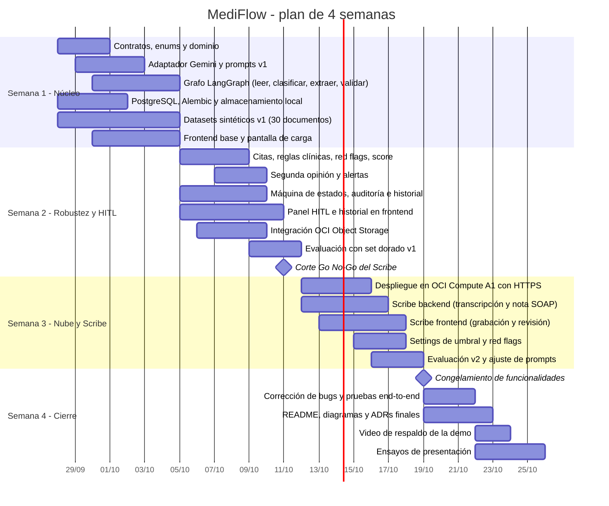

# MediFlow — Plan Final de Ejecución

**Horizonte:** 4 semanas (28 de septiembre → 25 de octubre de 2026), con variante comprimida de 3 semanas.
**Objetivo:** ganar el hackathon con un MVP completo, robusto y bien documentado, más un módulo extendido de consulta por voz que demuestre visión de producto.

---

## 0. Veredicto en una página

| Tema | Decisión final |
|---|---|
| Arquitectura | **Monolito modular con arquitectura hexagonal** (Ports & Adapters) en un solo backend FastAPI. No microservicios. |
| Orquestación IA | **LangGraph**, grafo *stateless* por request, con aristas condicionales. El HITL **no** vive en LangGraph: vive en la máquina de estados del dominio + PostgreSQL. |
| Modelo | **Gemini 3.5 Flash** principal, **Gemini 3.1 Flash-Lite** como fallback. Nada de Gemini 2.5 (retiro el 16/10/2026). MedGemma y MedASR descartados (ver sección 2). |
| Técnicas de fiabilidad | System instructions + salida estructurada con esquema Pydantic + `thinking_level` variable + safety settings ajustados + **verificación de citas** + **red flags deterministas** + **segunda opinión en urgencias**. Temperatura por defecto, validada con el set dorado. |
| Base de datos | **PostgreSQL 16** en contenedor dentro de la VM OCI Ampere A1 (todo en OCI). Plan B: Postgres gestionado externo si no hay capacidad A1. |
| Frontend | **React + TypeScript + Vite + Tailwind + TanStack Query + React Hook Form + Zod**. Sin cambios de stack. |
| Módulo Doctoc | Implementar **nuestra propia versión** de la transcripción clínica por voz (*ambient scribe*), como **Módulo 2**, reutilizando el motor de extracción. Solo si el MVP pasa el corte de la semana 2. |
| Diferencial para el jurado | Un sistema diseñado **asumiendo que la IA se equivoca**: evidencia por campo, reglas deterministas, segunda opinión, alerta ≠ enrutamiento, humano con la última palabra, y métricas que lo demuestran. |

---

## 1. Qué ofrece Doctoc y qué vamos a construir nosotros

### 1.1 Hallazgos verificados

| Aspecto | Lo que ofrece Doctoc |
|---|---|
| Producto | Historia clínica electrónica con IA para médicos y clínicas en Latinoamérica: historia clínica, agenda, finanzas, imágenes y archivos |
| Transcripción IA | Incluida en el **plan Pro** (S/ 139 al mes, o S/ 125 al mes con pago anual): el médico habla con el paciente y Doctoc transcribe la historia clínica |
| Recetas | Recetas firmadas enviadas al paciente por WhatsApp o correo |
| Diagnósticos | Buscador con CIE-10 integrado |
| Plantillas | Plantillas médicas personalizables |
| "Clara" | Agente de IA que automatiza llamadas y mensajes (agenda) |
| Métricas publicadas | Más de 500 000 pacientes atendidos, 30 % de tiempo ahorrado escribiendo, 12 minutos ahorrados por cita |
| Enfoque técnico (según el pitch) | Proveedor externo de transcripción robusto al ruido + modelos clínicos + ingeniería de contexto; la salida es **data separada** (por ejemplo, presión arterial como número), no un resumen largo; el médico revisa antes de cerrar la atención |

**Lectura:** existe un mercado real que paga por la transcripción clínica. Es una prueba de validación de mercado que podemos citar en el pitch.

### 1.2 Qué replicamos, qué mejoramos y qué dejamos fuera

| Funcionalidad | Decisión | Detalle |
|---|---|---|
| Transcripción de la consulta | **Replicamos** | Grabación en el navegador → transcripción diarizada con Gemini |
| Datos estructurados (no un resumen) | **Replicamos** | Nota SOAP con signos vitales numéricos, diagnósticos, CIE-10 sugerido, medicamentos con dosis/vía/frecuencia/duración |
| Revisión del médico antes de cerrar | **Replicamos** | Estado `DRAFT_READY` obligatorio; solo `SIGNED` por acción humana |
| Evidencia por campo | **Mejoramos** | Cada dato enlaza al segmento de audio; el sistema comprueba que el segmento exista |
| Validación clínica | **Mejoramos** | Rangos de signos vitales y dosis; valores imposibles resaltados en rojo |
| Motor compartido con documentos | **Mejoramos** | Un solo motor para documentos externos y consultas: misma validación, mismo score |
| Indicaciones para el paciente | **Replicamos (simplificado)** | Texto en lenguaje simple generado solo después de la firma |
| Receta firmada y envío por WhatsApp | **Fuera de alcance** | Requiere firma electrónica certificada y proveedor de mensajería |
| Agenda por WhatsApp ("Clara") | **Fuera de alcance** | No aporta al reto del hackathon |
| Finanzas, agenda, facturación | **Fuera de alcance** | Idem |

### 1.3 Por qué Gemini para la voz y no otra opción

| Opción | Veredicto | Motivo |
|---|---|---|
| **Gemini (audio nativo)** | ✅ Elegido | Transcribe con diarización y marcas de tiempo, acepta `audio/webm` (lo que produce el navegador) y admite audios muy largos por petición. Mismo SDK y API key que el resto del proyecto. |
| MedASR (Google, open source) | ❌ | Optimizado solo para inglés; nuestras consultas son en español. |
| MedGemma (Google, open source) | ❌ | Excelente en texto médico, pero corre localmente con GPU; OCI Always Free no ofrece GPU. Se menciona en el README como alternativa evaluada. |
| Google Cloud Speech-to-Text | ⏸ Futuro | Útil para transcripción en tiempo real; agrega otra cuenta, otra facturación y otra integración. |

---

## 2. Decisiones de arquitectura (formato ADR)

| # | Decisión | Alternativa descartada | Razón |
|---|---|---|---|
| ADR-01 | Monolito modular hexagonal en FastAPI | Backend y "IA core" como servicios separados | Misma separación de responsabilidades sin latencia de red, reintentos entre servicios ni dos runtimes en una VM limitada |
| ADR-02 | LangGraph stateless por request | Checkpointer de LangGraph + `interrupt()` para HITL | El HITL puede durar días; es más robusto como máquina de estados en PostgreSQL que como estado del framework |
| ADR-03 | HITL en dominio + PostgreSQL con bloqueo de fila | HITL en memoria o en el framework | Concurrencia segura (`SELECT … FOR UPDATE`), historial auditable |
| ADR-04 | `requiere_auditoria_humana` derivado de `status` | Guardarlo como columna | Un valor derivado almacenado se desincroniza |
| ADR-05 | `audit_reasons` con ownership: semánticos (grafo) y técnicos (adaptador LLM) | Motivos genéricos emitidos por cualquiera | Cada componente reporta solo lo que puede observar |
| ADR-06 | Gemini 3.5 Flash + 3.1 Flash-Lite de fallback | Gemini 2.5 | La familia 2.5 se retira el 16/10/2026, dentro de la ventana del proyecto |
| ADR-07 | Temperatura por defecto, validada empíricamente | Temperatura 0.0 por costumbre | Google recomienda no bajarla en Gemini 3; la determinación la dan el esquema y las validaciones |
| ADR-08 | Verificación de citas contra la fuente | Confiar en la extracción | Detecta alucinaciones de forma determinista y barata |
| ADR-09 | Red flags deterministas + segunda opinión en urgencias | Solo la prioridad que dice el LLM | Reduce falsos negativos, que son el error más peligroso |
| ADR-10 | Alerta ≠ enrutamiento | La urgencia espera a la auditoría | La atención no debe esperar a lo administrativo |
| ADR-11 | PostgreSQL en la VM OCI | Neon / Supabase / Convex / Autonomous DB | Todo dentro de OCI, JSONB nativo, cero dependencias externas; Neon queda como plan B |
| ADR-12 | Scribe en dos pasos (transcribir → extraer) | Un solo paso audio → nota | La transcripción queda como fuente auditable para verificar evidencias |
| ADR-13 | Dos endpoints de ingesta (`process-file`, `process-text`) | Un endpoint multiformato | Contratos explícitos y validación simple |

---

## 3. Separación de responsabilidades

### 3.1 Por capa de código

| Capa | Responsabilidad | Prohibido |
|---|---|---|
| `domain` | Enums, entidades, máquina de estados, reglas R1–R4, reglas clínicas, red flags, verificación de citas, score | Importar FastAPI, SQLAlchemy, SDKs de Gemini u OCI |
| `application` | Casos de uso, grafo LangGraph, definición de puertos | Conocer HTTP, SQL o el SDK concreto |
| `adapters/inbound` | Traducir HTTP ↔ casos de uso, DTOs, códigos de error | Lógica de negocio |
| `adapters/outbound` | Implementar puertos: Gemini, OCI, PostgreSQL, Slack, SMTP | Decidir estados o destinos |
| `infrastructure` | Configuración, conexión a BD, inyección de dependencias, logging | Lógica de negocio |

### 3.2 Por actor (IA, sistema, humano)

| Decisión | IA | Sistema | Humano |
|---|---|---|---|
| Tipo de documento y prioridad | Propone | Valida contra enum, red flags y segunda opinión | Corrige en auditoría |
| Datos extraídos | Propone con evidencia | Verifica esquema, citas y rangos | Corrige en auditoría |
| Score de confianza | Aporta 30 % | Calcula el 70 % restante y el global | — |
| Estado del documento | — | Decide | Aprueba o rechaza en `NEEDS_AUDIT` |
| Enrutamiento | Sugiere | Ejecuta solo si `PROCESSED` o `APPROVED` | Confirma en auditoría |
| Alerta de urgencia | — | Emite siempre que haya urgencia | — |
| Nota clínica por voz | Redacta borrador | Valida | **Firma siempre** |

### 3.3 Del esquema anterior de "8 casos" a la versión final

| Caso anterior | Versión final |
|---|---|
| 1 · Urgente | R1 → `EMERGENCIA_MEDICA` + alerta |
| 2 · Orden de procedimiento | R2 → `AUDITORIA_AUTORIZACIONES` |
| 3 · Receta | R3 → `FARMACIA` |
| 4 · Informe / epicrisis / certificado | R4 → `HISTORIA_CLINICA` |
| 5 · Score bajo | `LOW_CONFIDENCE` |
| 6 · Conflicto de datos | `MISSING_CRITICAL_FIELDS` o `INCONSISTENT_DATA` |
| 7 · Fallo técnico | `AI_TIMEOUT`, `AI_UNAVAILABLE`, `INVALID_AI_RESPONSE`, `AI_SAFETY_BLOCKED` |
| 8 · Tipo no reconocido | `UNSUPPORTED_DOCUMENT_TYPE` (destino `REVISION_HUMANA`) |
| *Nuevo* | `ILLEGIBLE_DOCUMENT`, `URGENCY_DISAGREEMENT` |

---

## 4. Configuración del modelo (resumen operativo)

| Llamada | Modelo | `thinking_level` | Esquema de salida |
|---|---|---|---|
| Leer documento (texto fuente) | 3.5 Flash | `low` | `{ texto_fuente, legible, idioma }` |
| Clasificar | 3.5 Flash | `low` | `{ tipo_documento, especialidad, nivel_prioridad, confianza, motivo }` |
| Extraer | 3.5 Flash | `low` | Esquema por tipo con `evidencia` por campo |
| Segunda opinión (solo urgentes) | 3.5 Flash | `high` | `{ es_urgente, justificacion, hallazgos_criticos }` |
| Transcribir audio | 3.5 Flash | `low` | `{ segmentos: [{ id, hablante, inicio, fin, texto }] }` |
| Nota SOAP | 3.5 Flash | `low` | Nota SOAP con `evidencia_segmentos` por campo |
| Indicaciones al paciente | 3.1 Flash-Lite | `minimal` | `{ indicaciones: [...] }` |

**Reglas de prompt (system instruction):**

1. "Eres un asistente de documentación clínica. No diagnosticas ni recomiendas tratamientos."
2. "Usa exclusivamente los valores de los enums permitidos."
3. "Si un dato no aparece en la fuente, devuelve `null`. Nunca lo infieras."
4. "Para cada dato devuelve la cita textual exacta de la que lo obtuviste."
5. "Si el documento no es legible, indícalo en `legible=false`."

**Tokens y costos:** registrar `usage_metadata` de cada llamada en logs para estimar costo por documento en la presentación.

---

## 5. Cronograma de 4 semanas

### Semana 1 — Núcleo funcional (28/09 → 04/10)

| Área | Tareas | Criterio de terminado |
|---|---|---|
| Arquitectura | Estructura de carpetas hexagonal; `domain/enums.py`; contratos DTO; ADR-01 a ADR-05 escritos | El equipo programa contra contratos fijos |
| IA | `LLMPort`, `GeminiAdapter` con timeout y reintento; prompts v1 de clasificación y extracción; esquemas Pydantic por tipo | Los 6 tipos se clasifican y extraen desde un script |
| Backend | `process-text` y `process-file`; repositorio PostgreSQL; `LocalStorageAdapter`; migraciones | `POST` devuelve la respuesta canónica con datos reales |
| Grafo | Nodos leer → clasificar → extraer → validar | Grafo compila y pasa pruebas unitarias con LLM simulado |
| Frontend | Proyecto Vite + Tailwind; tipos TS del contrato; pantalla de carga con resultado | Se sube un documento y se ve el JSON formateado en tarjetas |
| Producto/QA | 30 documentos sintéticos (5 por tipo) con etiquetas esperadas | Dataset versionado en `datasets/` |

**Hito semana 1:** escenario 1 (rutina) funcionando de punta a punta en local.

### Semana 2 — Robustez, seguridad clínica y HITL (05/10 → 11/10)

| Área | Tareas | Criterio de terminado |
|---|---|---|
| Dominio | `evidence.py`, `clinical_rules.py`, `red_flags.py`, `confidence.py`, `routing.py`, `state_machine.py` | 100 % de cobertura en reglas de dominio |
| IA | Segunda opinión con `thinking_level=high`; manejo de `AI_SAFETY_BLOCKED` | Escenarios 2 y 4 correctos |
| Backend | `/audit/queue`, `PATCH /review` con bloqueo de fila, `/history`, `/content`; notificaciones Slack/email | Escenarios 3 y 5 correctos; revisión concurrente devuelve 409 |
| OCI | Bucket privado, `OCIStorageAdapter`, prefijos y movimiento entre estados | Documentos visibles en la consola OCI en el prefijo correcto |
| Frontend | Panel HITL (visor + formulario), historial con filtros, badges de estado y prioridad, resaltado de evidencia | Auditor aprueba un caso desde la UI |
| QA | Primera corrida del set dorado; tabla de métricas | Métricas registradas en `docs/` |

**Corte Go / No-Go del Scribe (11/10):** se construye el Módulo 2 **solo si** los escenarios 1–5 funcionan de punta a punta y el recall de urgencias es 100 % en el set. Si no, la semana 3 se dedica a cerrar brechas del MVP y el Scribe pasa a "trabajo futuro" en el README.

### Semana 3 — Nube y módulo de voz (12/10 → 18/10)

| Área | Tareas | Criterio de terminado |
|---|---|---|
| OCI | VM Ampere A1, Docker Compose prod, Nginx, HTTPS, Instance Principals | URL pública funcionando con los 5 escenarios |
| Scribe backend | `POST /consultations`, transcripción diarizada, nota SOAP con evidencia, validación de signos vitales y dosis, `PATCH /note` | Audio de prueba → borrador `DRAFT_READY` correcto |
| Scribe frontend | Grabación con `MediaRecorder`, checkbox de consentimiento, vista de transcripción + nota con evidencias clicables, firma | Médico firma una nota desde la UI |
| Diferencial | `/settings/triage`: umbral y red flags editables | Cambiar el umbral cambia el enrutamiento sin redeploy |
| QA | Set dorado v2 (variantes degradadas); 3 audios sintéticos guionizados | Métricas actualizadas |

### Semana 4 — Cierre y presentación (19/10 → 25/10)

| Área | Tareas | Criterio de terminado |
|---|---|---|
| Todos | Congelamiento de funcionalidades el 19/10; solo corrección de bugs | Sin funcionalidades nuevas |
| QA | Pruebas end-to-end de los 6 escenarios en la URL pública | Checklist verde |
| Documentación | README final, diagrama Eraser exportado a imagen, ADRs, métricas | Repositorio listo para el jurado |
| Presentación | Guion, diapositivas, video de respaldo de la demo (por si falla la red) | Dos ensayos cronometrados |

### Variante comprimida de 3 semanas

- Semana 1 igual.
- Semana 2 igual, pero el despliegue en OCI Compute se adelanta a los últimos dos días.
- Semana 3 = semana 4 del plan (cierre). **El Scribe se omite** y se presenta como diseño + trabajo futuro.

---

## 6. Priorización (MoSCoW)

| Prioridad | Elementos |
|---|---|
| **Must** | Ingesta texto/PDF/imagen · clasificación · extracción con esquema · validación · score · reglas R1–R4 · `audit_reasons` · máquina de estados · HITL · OCI Object Storage · 3 escenarios obligatorios · README con diagramas |
| **Should** | Verificación de citas · red flags · segunda opinión · alertas Slack/email · historial · despliegue en OCI Compute · set dorado con métricas |
| **Could** | Módulo Scribe · settings editables · indicaciones al paciente · exportación del resultado |
| **Won't (en este hackathon)** | Autenticación y roles · tiempo real · FHIR · firma electrónica · WhatsApp · colas asíncronas |

---

## 7. Riesgos y mitigaciones

| Riesgo | Probabilidad | Impacto | Mitigación |
|---|---|---|---|
| Sin capacidad Ampere A1 en la región | Media | Alto | Intentar temprano (semana 1); plan B: VM micro + Postgres gestionado externo |
| Modelo preview o cambios de API de Gemini | Baja | Alto | Usar modelos estables; nombre del modelo por variable de entorno; fallback configurado |
| Filtros de seguridad bloquean texto clínico | Media | Medio | Ajustar `safety_settings`; convertir bloqueo en `AI_SAFETY_BLOCKED` → auditoría |
| Cuota o límite de la API gratuita | Media | Medio | Cachear resultados del set dorado; API key de respaldo para la demo |
| Latencia alta con segunda opinión | Media | Bajo | Solo se ejecuta en urgencias; `thinking_level=low` en el resto |
| Alucinación de datos | Alta | Alto | Verificación de citas, esquema estricto, reglas clínicas, HITL |
| Falla de red durante la demo | Media | Alto | Video de respaldo + datos precargados en la instancia |
| Scope creep con el Scribe | Alta | Alto | Corte Go/No-Go del 11/10 con criterio objetivo |

---

## 8. Guion de demo (7 minutos)

| Minuto | Contenido |
|---|---|
| 0:00–0:45 | Problema: horas perdidas transcribiendo y urgencias que esperan en una bandeja. Dato de mercado: el mercado ya paga por transcripción clínica con IA. |
| 0:45–1:30 | Arquitectura en una imagen (Eraser) y el principio: la IA propone, el sistema verifica, el humano decide. |
| 1:30–2:30 | Escenario 1 — rutina: informe de laboratorio → Historia Clínica, sin intervención. Mostrar evidencia por campo. |
| 2:30–3:30 | Escenario 2 — urgencia: TEP agudo → alerta en Slack en segundos, segunda opinión confirmada, documento en `procesados/urgentes/` en la consola OCI. |
| 3:30–4:30 | Escenario 3 — ambigüedad: receta con matrícula ilegible → panel HITL → auditor corrige → aprobado → Farmacia. |
| 4:30–5:15 | Escenario 4 — red flag: el modelo se equivocó y el sistema lo atrapó. "Asumimos que la IA se equivoca." |
| 5:15–6:15 | Módulo Scribe (si está listo): consulta grabada → nota SOAP con presión arterial como número y evidencia clicable → firma del médico. |
| 6:15–7:00 | Métricas del set dorado (recall de urgencias 100 %), OCI Always Free, trabajo futuro. |

---

## 9. Checklist final antes de presentar

- [ ] Los 3 escenarios obligatorios funcionan en la URL pública.
- [ ] Bucket OCI con documentos en los prefijos correctos (captura de pantalla lista).
- [ ] README con diagrama de arquitectura y del flujo del agente.
- [ ] Commits descriptivos (convención: `feat:`, `fix:`, `docs:`, `test:`, `refactor:`).
- [ ] `.env.example` completo y sin secretos en el historial de Git.
- [ ] Métricas del set dorado publicadas.
- [ ] Aviso de "no es dispositivo médico" visible en README y en la interfaz.
- [ ] Video de respaldo de la demo.
- [ ] Ensayo cronometrado bajo 7 minutos.
