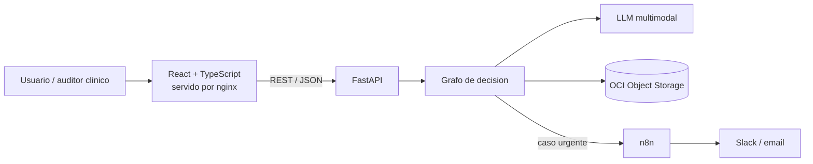
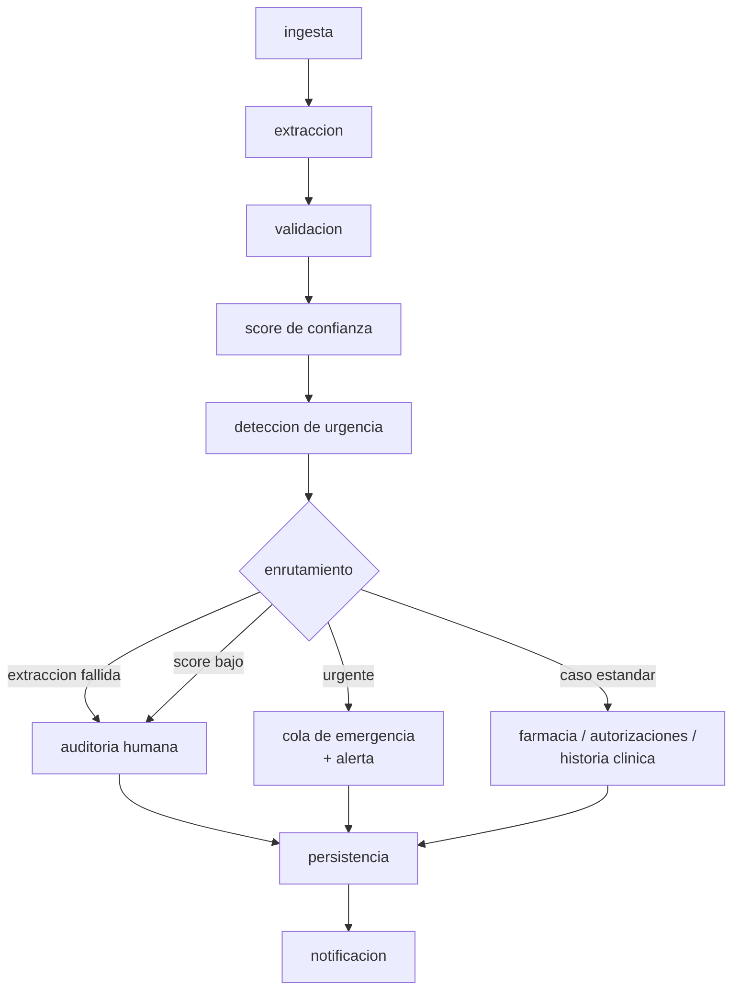

# MediFlow — Plan de trabajo del equipo

> **Propuesta para validar en el kickoff (Semana 0).** Nada de esto está cerrado: la sección [Decisiones a validar](#decisiones-a-validar-en-el-kickoff) lista los puntos que definimos entre todos. Las fechas son provisorias hasta confirmarlas con el manual oficial del hackathon.

MediFlow es un agente autónomo que recibe documentos clínicos (texto, PDF o imagen), los clasifica, extrae los datos con un LLM multimodal, calcula un puntaje de confianza, detecta urgencias médicas y enruta cada documento al destino correcto. Los casos ambiguos van a una cola de revisión humana. El detalle completo del proyecto está en [`mediflow-agente-autonomo.md`](mediflow-agente-autonomo.md).

**Equipo:** 6 integrantes activos de varios países — 1 frontend, 1 PM y 4 backend (uno de ellos, el tech lead, dueño de la cuenta de OCI). Nos organizamos directamente por las 4 áreas de "Resultados esperados" del instructivo oficial en vez de por stack — ver [Roles](#roles).

---

## Índice

- [Qué evalúan y quién lo cubre](#qué-evalúan-y-quién-lo-cubre)
- [Arquitectura propuesta](#arquitectura-propuesta)
- [Grafo de decisión](#grafo-de-decisión)
- [Contrato de la API](#contrato-de-la-api)
- [Estructura del repositorio](#estructura-del-repositorio)
- [Roles](#roles)
- [Cronograma](#cronograma)
- [Ceremonias y forma de trabajo](#ceremonias-y-forma-de-trabajo)
- [Decisiones a validar en el kickoff](#decisiones-a-validar-en-el-kickoff)
- [Riesgos](#riesgos)

---

## Qué evalúan y quién lo cubre

Cada requisito obligatorio tiene un responsable y un sprint, así ninguno queda sin dueño:

| Requisito mínimo | Componente | Responsable | Sprint |
|---|---|---|---|
| Ingesta de texto, PDF e imagen | API de ingesta + nodo `ingesta` | Back 3 | S1 (texto), S2 (archivos) |
| Clasificación del documento con LLM | Nodo `extraccion` | Back 1 | S1 |
| Extracción de datos clínicos en JSON | Schemas Pydantic + salida estructurada | Back 1 | S1 |
| Decisión condicional (ambiguo / urgente) | Grafo + reglas | Back 2 | S1–S2 |
| OCI Object Storage | Módulo de almacenamiento | Tech lead + Back 3 | S2 |
| 3 escenarios de demostración | Documentos sintéticos + golden set | Back 1 + PM | S0–S2 |
| README con diagrama del flujo | Diagrama generado desde el grafo | PM + Back 2 | S4 |

Los diferenciales, ordenados por lo que suman frente a lo que cuestan:

1. **Panel de revisión humana (HITL)** — S2. Es casi obligatorio: es el destino de los casos ambiguos.
2. **Despliegue en OCI Compute** — S3.
3. **Alertas en tiempo real con n8n** — S3.
4. **Reglas de triaje editables desde la interfaz** — S3.
5. **Lectura de recetas manuscritas** — S3, si el modelo responde bien.

## Arquitectura propuesta



| Capa | Elección | Por qué |
|---|---|---|
| Frontend | React + TypeScript (Vite) | Ahora hay un solo perfil frontend en el equipo: a revisar en el kickoff si conviene mantener React o simplificar a Streamlit para bajar la carga de una sola persona (ver [Decisiones a validar](#decisiones-a-validar-en-el-kickoff)) |
| API | FastAPI + Pydantic v2 | Genera la documentación OpenAPI sola, y de ahí el frontend genera sus tipos de TypeScript |
| Orquestación | LangGraph | Sugerido por el instructivo. El grafo queda explícito y exporta su propio diagrama, así el del README nunca queda desactualizado |
| LLM | Detrás de un único módulo | Empezamos con el modelo gratuito de Gemini. Si falla o cambia, se reemplaza ese módulo y nada más |
| Almacenamiento | OCI Object Storage: 1 bucket, un prefijo por estado | Es lo que muestra el ejemplo oficial (`ruta_objeto: procesados/urgentes/...`). Para desarrollo y tests hay una versión local, así nadie necesita credenciales de OCI para trabajar |
| Base de datos | Ninguna | El bucket guarda el documento y el JSON de la decisión; el historial se arma listando el bucket. Los registros de ejecución van a un archivo JSONL |
| Alertas | n8n, solo notificaciones | El núcleo queda en Python y se puede testear; n8n recibe un webhook y avisa |
| Despliegue | Docker Compose en OCI Compute | Las imágenes se compilan en GitHub Actions y la máquina virtual solo las descarga |

**Principio central: el LLM propone, el código decide.**

El modelo extrae los datos y sugiere el tipo de documento y la prioridad. El puntaje de confianza y el destino los calcula nuestro código, con reglas explícitas que se pueden testear y auditar. Además de ser más confiable, evita que una frase dentro del documento ("derivar a farmacia") cambie el destino.

## Grafo de decisión



- **`ingesta`** — valida el tamaño y el tipo real del archivo y lo guarda en `recibidos/`.
- **`extraccion`** — el LLM lee el documento y devuelve los datos con una estructura fija. Si la respuesta no es válida, reintenta una vez.
- **`validacion`** — Pydantic más reglas de consistencia: campos obligatorios según el tipo de documento, formato del CIE-10, matrícula del profesional, dosis en las recetas, edad coherente.
- **`score`** — lo calcula el código combinando la autoevaluación del modelo, qué tan completos están los campos obligatorios y una penalización por cada inconsistencia. Los pesos se ajustan en el Sprint 4 con el golden set.
- **`urgencia`** — es urgente si lo dice el modelo **o** si aparece algún signo de alarma de la lista. En salud, dejar pasar una urgencia es mucho peor que revisar un caso de más.
- **Enrutamiento** — Receta → Farmacia; Orden de procedimiento → Auditoría de Autorizaciones; Informe, Epicrisis o Certificado → Historia Clínica. Un caso urgente con confianza baja va a la cola de emergencia **y** además se marca para revisión humana: la alerta sale igual.
- **`persistencia`** — documento original y JSON de la decisión en `procesados/<destino>/` o en `auditoria_humana/`. Procesar dos veces el mismo documento no duplica nada.
- **`notificacion`** — webhook a n8n. Si n8n falla, queda registrado en la respuesta y el triaje no se cae.

Umbral, signos de alarma y mapa de destinos viven en un archivo de reglas (`reglas_triaje.yaml`), no dentro del código. Con eso, el diferencial de "reglas configurables" se reduce a agregar una pantalla.

## Contrato de la API

Se congela en la Semana 0. Desde entonces, cualquier cambio se discute y se registra.

| Método | Ruta | Para qué |
|---|---|---|
| POST | `/api/v1/triajes` | Documento en texto (es el formato del ejemplo oficial) |
| POST | `/api/v1/triajes/archivo` | PDF o imagen + canal de origen |
| GET | `/api/v1/triajes` | Historial, con filtros por estado y destino |
| GET | `/api/v1/triajes/{id}` | Detalle de un triaje |
| GET | `/api/v1/triajes/{id}/documento` | Documento original, para el visor de revisión |
| POST | `/api/v1/triajes/{id}/revision` | Aprobar, corregir o rechazar, con registro de quién y cuándo |
| GET / PUT | `/api/v1/reglas` | Reglas de triaje (diferencial) |
| GET | `/health` | Estado del servicio |

La respuesta respeta la estructura del ejemplo oficial: `clasificacion`, `datos_extraidos`, `decision_enrutamiento` y `almacenamiento_oci`. En la Semana 0 el backend entrega estos endpoints devolviendo el JSON de ejemplo, así el frontend arranca sin esperar a que el agente esté listo.

## Estructura del repositorio

```
backend/     API, grafo, integraciones, tests
frontend/    React + TypeScript
n8n/         workflows exportados
data/        documentos sintéticos + generador
infra/       Docker Compose, nginx, despliegue
docs/        este plan, decisiones y evidencia
```

## Roles

Bajamos de 8 a **6 integrantes activos** y quedó un solo perfil frontend. En vez de repartir por stack (backend / frontend / full stack), nos organizamos directamente por las **4 áreas de "Resultados esperados"** del instructivo oficial: así el trabajo de cada quien coincide 1 a 1 con lo que se evalúa.

| Área del instructivo | Qué entrega | Responsable(s) | Apoyo |
|---|---|---|---|
| **1. IA Multimodal, Agentes & Lógica de Decisión** | Pipeline de ingesta/extracción con LLM multimodal, grafo de decisión (LangGraph o condicional en Python), score de confianza y detección de urgencia | Back 1 (extracción) + Back 2 (grafo y score) | Tech lead revisa el diseño del grafo |
| **2. Automatización de Flujos & Back-End** | Endpoint/pantalla de envío de documentos, ejecución del triaje y enrutamiento, fallback a revisión humana, validación con Pydantic/JSON Schema | Back 3 | Frontend arma la pantalla de envío y el tablero de triaje |
| **3. Oracle Cloud Infrastructure (OCI)** | Buckets segregados por estado (obligatorio); despliegue en OCI Compute (diferencial) | Tech lead — es quien tiene la tenancy | Back 3 integra el cliente de storage en el backend |
| **4. Documentación & Demostración** | Commits bien documentados, README con arquitectura y diagrama del flujo, guion y grabación de la demo | PM | Cada responsable de área documenta su parte; el PM arma el README final |

Frontend y PM son un solo perfil cada uno: son punto único de falla del área 2 (pantallas) y del área 4 (documentación/demo) — ver [Riesgos](#riesgos). Los 4 backend se cubren entre sí: cualquiera de los 3 restantes puede tomar una tarea si alguien queda bloqueado.

## Cronograma

**Semana 0 · Planificación** — kickoff (presentación, países, horarios y disponibilidad), validar este plan, asignar roles, armar el backlog, bocetos de las pantallas, crear la estructura del repo, definir el contrato con endpoints de prueba, elegir el modelo probándolo con 5 documentos, preparar la cuenta de OCI (bucket y permisos) y generar entre 10 y 15 documentos sintéticos con su resultado esperado.

**Sprint 1 · Flujo con texto** — documento en texto → extracción → validación → confianza → destino → guardado local. El frontend ya consume la API real.
*Demo: un documento triado de punta a punta.*

**Sprint 2 · MVP obligatorio** — PDF e imagen, OCI Object Storage real, revisión humana (API y pantalla), tablero e historial.
*Demo, y es el hito más importante: los 3 escenarios completos guardando en OCI.*

**Sprint 3 · Diferenciales** — despliegue en OCI Compute, alertas con n8n, reglas editables y recetas manuscritas.
*Demo: la aplicación funcionando en una dirección pública, con una alerta real.*

**Sprint 4 · Calidad** — batería de evaluación y ajuste de umbrales, seguridad, tests, README con diagramas y métricas. Al cierre del sprint no se agregan más funcionalidades.
*Demo: los resultados de la evaluación.*

**Semana final · Demo Day** — ensayos de la presentación, evidencia del despliegue, video y entrega. Solo corrección de errores.

## Ceremonias y forma de trabajo

- **Daily de 15 minutos** en la franja horaria en la que coincidimos. Quien no pueda conectarse deja su avance por escrito antes de la reunión: qué hizo, qué sigue y qué lo bloquea.
- **Reunión semanal con el Team Leader**, con el PM y el tech lead como mínimo.
- **Planificación** al inicio de cada sprint y **demo con retrospectiva breve** al cierre. Rotamos quién presenta, así todos muestran su parte.
- **Decisiones** que cambien el rumbo se anotan en `docs/` en media carilla: qué se decidió y por qué.
- **Backlog** en GitHub Projects.

**Git:** una rama por tarea (`feat/...`), pull request con una revisión antes de integrar, mensajes de commit descriptivos. Integramos sin aplastar los commits, para que el trabajo de cada integrante quede visible en el historial. La integración continua corre los tests y compila el frontend en cada pull request.

**Datos:** trabajamos **solo con documentos sintéticos**. Nunca datos reales de pacientes: hay legislación de datos de salud en todos nuestros países y el servicio gratuito del modelo puede usar lo que se le envía.

## Decisiones a validar en el kickoff

1. La arquitectura propuesta más arriba.
2. El modelo a usar, según el resultado de la prueba, y qué alternativa tomamos si falla.
3. El ejemplo oficial trae la clave `"nome"` en portugués: ¿la respetamos tal cual o la corregimos?
4. Un solo bucket con prefijos por estado.
5. Umbral inicial de confianza y lista de signos de alarma. No tenemos personal médico en el equipo: nos basamos en fuentes públicas y el README aclara que esto no es un dispositivo médico.
6. Idioma de los nombres de variables y funciones en el código.
7. Horario de la daily.
8. Asignación concreta de los roles.
9. Fechas oficiales y criterios de evaluación del manual del hackathon.
10. Con un solo frontend, ¿mantenemos React + TypeScript o simplificamos a Streamlit/Gradio para bajar la carga de una sola persona?
11. Con 6 activos en vez de 8, qué diferenciales del Sprint 3 recortamos si el MVP del Sprint 2 se atrasa.

## Riesgos

| Riesgo | Cómo lo manejamos |
|---|---|
| El modelo gratuito cambia, se retira o se agota la cuota | Un solo módulo habla con el proveedor, el modelo se configura por variable de entorno y cada integrante usa su propia clave |
| La capa gratuita de OCI tiene máquinas chicas y a veces sin disponibilidad | Dos máquinas pequeñas en lugar de una grande; las imágenes se compilan fuera de la máquina |
| Frontend y backend se integran tarde y aparecen sorpresas | Contrato congelado y endpoints de prueba desde la Semana 0 |
| Husos horarios y disponibilidad despareja | Responsable y suplente por frente; daily por escrito |
| Se agregan funcionalidades antes de tener el MVP | El MVP completo es el hito del Sprint 2; los diferenciales recién empiezan en el Sprint 3 |
| Uso de datos reales de pacientes | Prohibido; todos los documentos salen de nuestro generador |
| Un solo frontend: si se bloquea, el área 2 (pantallas) se frena | Backend 3 conoce el contrato y puede avanzar con una pantalla mínima si hace falta |
| Un solo PM: si se bloquea, la documentación y la demo se atrasan | Cada responsable de área documenta su propia parte a medida que avanza, no todo al final |
| Equipo más chico (6 en vez de 8) con el mismo alcance obligatorio | El MVP del Sprint 2 no se toca; los diferenciales del Sprint 3 se priorizan o recortan según cómo venga el Sprint 2 |
